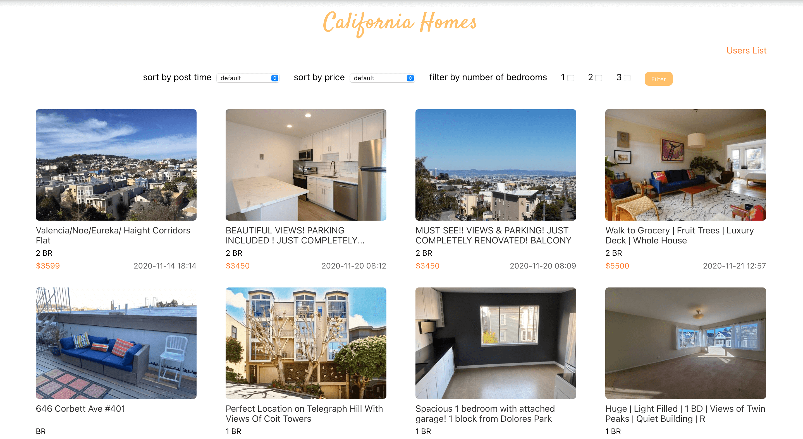
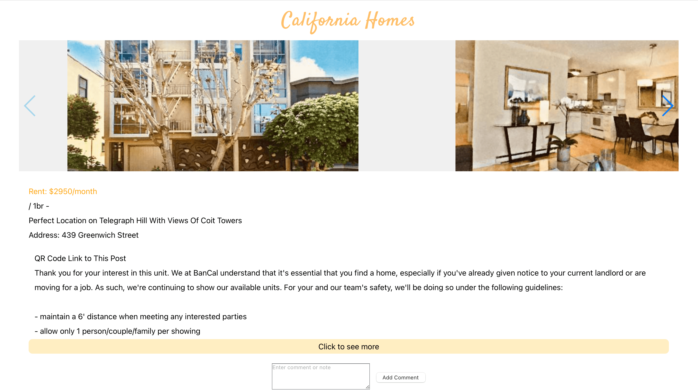

# California Homes Web App

Welcome to California Homes, your friend in finding your home in the sunny Golden State of California! Our website shows our selected houses and apartments. You can filter housing by the number of bedrooms, and sort by prices, or post time. If you click the housing you're interested, it will take you to the house details page, where you can sign up and log in to add, edit and delete your notes and comments.

The community is growing and in the homepage you can find the link to the users' list page, where we list all of our users' username. Hope you like our website and find your perfect house in California!

### Screenshot

### Instruction to Build

The database is MongoDB Atlas and the website is hosted on heroku. To install and run, do the following:
Note you may need to contact us to get our MongoDB database url to run locally. Backend runs on port 3001 and frontend runs on port 3000.

npm install

npm start

cd client

npm install

npm start

### Project Objective

Design Website based on accessibilities and other design considerations. Learn and explore the popular and powerful MERN stack techologies (MongoDB, Express.js, React, and Node.js) to building dynamic web sites and web applications. Because all components of the MERN stack support programs that are written in JavaScript, we can learn more about Javascript via building the MERN applications using one language for both server-side and client-side execution environments.

### Author

Michelle Duan

### Class Link

CS 5610 Web Development
https://johnguerra.co/classes/webDevelopment_fall_2020/

### Licence

This project is under MIT license.


### Demo Video

Watch our project demo video here:
https://youtu.be/xWYDsJ_9v6I
